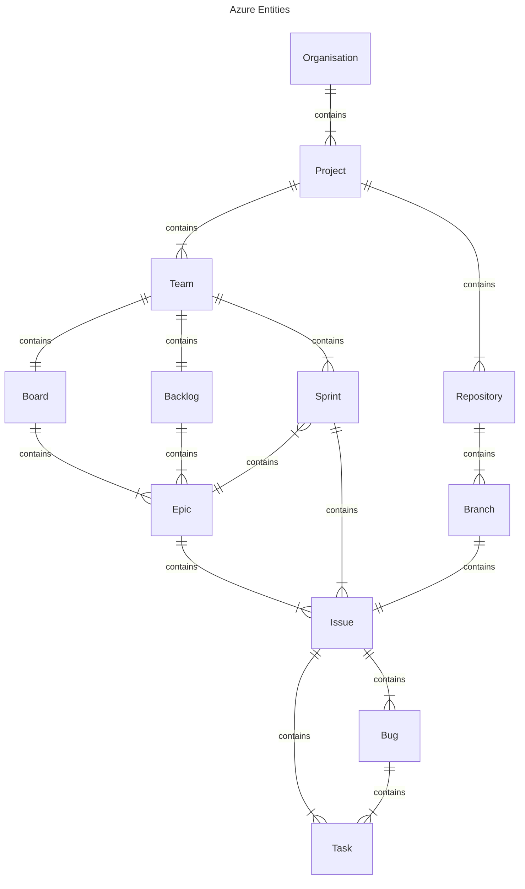

# Answering the Why

## Compartmentalization of Projects
The GIS & DT team take part in many projects, sometimes simultaneously, and often types covering different topics. As the team matures and grows, using features already within Azure will increase the level of quality of software delivered by the GIS & DT team. To begin this process, it is important to compartmentalize projects appropriately, as well as begin the process of familiarizing ourselves with the features Azure DevOps has to offer. 

The current structure of Azure DevOps assumes that all work conducted that uses Azure DevOps, usually projects which require software development, are all under one large project – BuroHappold GIS. The Buro Happold GIS project currently contains projects such as AlWadi, Quiddiya, Database work, GIS tools, and other similar work oriented around programming and software.

Although this setup is satisfactory for using Azure DevOps _purely_ as a [[Git]] repository, it doesn’t facilitate the leveraging of other important and useful Azure DevOps features, such as Boards, Pipelines, Test Plans, Dashboards and Wikis.

There are two key types of projects that are conducted within the GIS & DT team, internal and external. It is appropriate within the Azure DevOps organization to have multiple internal and external projects.

---
# Azure DevOps Structure

## Projects, Teams, Boards and Repositories

Azure DevOps has the ability to compartmentalize many aspects of work. The general architecture of Azure DevOps is as follows:

  <iframe loading="lazy" style="position: absolute; width: 100%; height: 100%; top: 0; left: 0; border: none; padding: 0;margin: 0;"
    src="https:&#x2F;&#x2F;www.canva.com&#x2F;design&#x2F;DAF948Zmee4&#x2F;HJg87mKZ7SxGGW6e9_PGVA&#x2F;view?embed" allowfullscreen="allowfullscreen" allow="fullscreen">
  </iframe>

The above diagram reads as follows:
The main (root) category is the **organization**, in our case BHGIS : [https://dev.azure.com/BHGIS](https://dev.azure.com/BHGIS). Organisations are made up of one or more **projects**. Projects are made up of one or more **teams**, and one or more **repositories**. Teams contain one **board**, one **backlog** and one or more **sprints**.  

Boards and backlogs are made up of one or more **epics**. Epics contain one or more **issues**. Issues are used to mean *any suggested improvement, feature, change, or question* -  it is a broad term used for something that could be a broad set of sub-tasks. Issues contain one or more **tasks**. **Bugs** are placed on the same level as issues, and are used to mean something that is **going wrong** with the work, and that could then be split up into tasks. 

Projects contain one or more **Repositories**. Repositories contain one or more **branches**, and ideally one branch is linked to one issue/feature. 

Although Azure DevOps is not immediately intuitive, the compartmentalization of projects, repositories, and tasks allows for clear lines of responsibility,  project progress views from multiple angles - per project, team and individual. This ensures that task allocation is also handled in a more dynamic manner - if a team member thinks of a new feature or idea, they can place an issue in the backlog and the project lead can allocate accordingly. 

## Organizations
When you open [Azure DevOps](https://dev.azure.com/BHGIS), you are directed to the organization home page.
Here you can view the projects you are assigned to, your assigned work items (Epics, issues, bugs and tasks) and your pull requests.
![[Pasted image 20240223144413.png]]
You can also search across the organization. This searches for any item for projects in which you are a member. 
![[Pasted image 20240223144754.png]]

### Projects
A project in the context of Azure DevOps is a remote location to keep information about a whole project and its processes. This includes information (via the dashboard/wiki), project management (via boards), work (via repositories), continuous integration processes (via pipelines, test plans). There is also the option to publish code across the team using libraries (via Artifacts). All of these features are contained within a single project.

If you are familiar GitHub for developing software, there is a key difference. Whereas GitHub has projects within repositories, Azure DevOps has repositories within projects. 

  <iframe loading="lazy" style="position: absolute; width: 150%; height: 150%; top: -100; left:-700; border: none; padding: 0;margin: 0;"
    src="https:&#x2F;&#x2F;www.canva.com&#x2F;design&#x2F;DAF95NxuCYE&#x2F;j1q-nuMLCETxEu9p3-oxkw&#x2F;view?embed" allowfullscreen="allowfullscreen" allow="fullscreen">
  </iframe>

##### The Digital Analytics Project
![[Pasted image 20240223144038.png]]

###### Summary
The summary of a features a brief 'about' section, programming languages (auto detected) and tags. Below these, there is a section documentation, rendered from the README.md that is taken from the project root repository.  
![[Pasted image 20240226141238.png]]
###### Dashboards 
Dashboards take project management information from the 'boards' section, and displays the data. Below is a typical dashboard. 
![[Pasted image 20240226143219.png]]

You can make your own dashboard, or look at a specific teams' dashboard if you're a member. 
![[Pasted image 20240226144729.png]]

###### Wiki
The wiki is a place to store written information about the project. This is a good place to store information about the general topic (in this case, digital analytics), and then the subtopics (NLP, sustainability modelling, etc.)
![[Pasted image 20240226144843.png]]

To create a new page, select 'Wiki' in Overview, then select 'New page' at the bottom. 
![[Pasted image 20240226145441.png]]

### Teams
A project can contain many teams. Teams contain individuals working on a particular part of a project. For Digital Analytics, there are 4 teams, with different people on different teams. 
### Boards
![[Pasted image 20240226145731.png]]
When selecting Boards, you are presented with 7 sub-options. 
1. *Work Items* - A list of Epics, Issues and tasks **across all teams** within the project.![[Pasted image 20240226154005.png]]
2. *Boards* - a 'Kanban Board' view for **specific teams** and **specific types** (issues or epics)![[Pasted image 20240226154035.png]]
3. *Backlog* - a log of all **epics or issues** for **specific teams**. Backlogs can also be used to plan sprints, by click-dragging a work item to a sprint on the right. ![[Pasted image 20240226154101.png]]
4. *Sprints* - a selection of work tasks to be done within a set period. These are taken from the **team backlog**.![[Pasted image 20240226154206.png]]
5. *Queries* - similar to how you can build queries for PowerBI, here you can specify a query on how to find specific information regarding work items (epics issues and tasks).![[Pasted image 20240226154317.png]]
6. *Delivery Plans* - This is where you can visualize sprints from **different teams** in one place, useful for understanding whole project progression.![[Pasted image 20240226154349.png]]
8. *Analytics Views* - Useful for viewing project analytics, basically like Queries but there are some predefined ones. These views can be integrated into PowerBI.  ![[Pasted image 20240226154412.png]]
### Repositories
When creating a new project, a **repository with the same name as the project** is automatically created. The README.md file in here automatically displayed in the Project Summary (within Overview)! Therefore, it is important to create a new repository for each team within a project. 
![[Pasted image 20240226155804.png]]
Repositories also contains 7 subsections. 
1. *Files* - this is where the repositories are, selecting the dropdown at the top will give you all the repositories within the project. ![[Pasted image 20240226155915.png]]
2. *Commits* - Commits are different *change* versions of the repository, and tracking the commits of a repository will show you who made what changes and when. This is why when invoking `git commit -m 'message'` it is important to give a message that other people can understand.![[Pasted image 20240226155947.png]]
3. *Pushes* - pushes are similar to commits in that they are different versions of the repository, however pushes show what has actually changed in the remote repository (ie on Azure DevOps).![[Pasted image 20240226160310.png]]
4. *Branches* - branches show the different branches of a repository, there should be a branch for each issue. ![[Pasted image 20240226160937.png]]
5. *Tags* - metadata elements that you apply to your Azure resources. They're key-value pairs that help you identify resources based on settings that are relevant to your organization.![[Pasted image 20240226161108.png]]
6. *Pull Requests* - When you have finished working on a branch, you can submit a pull request, used to pull your changed into the main branch. You can think of pull *requests* as though you were asking "are the changes made in my branch compatible with the changes in the main branch". Sometimes there are merge conflicts, which means you have made changes in the same parts of the code that other people have made changes in. This is where you need to [resolve merge conflicts](https://learn.microsoft.com/en-us/azure/devops/repos/git/merging?view=azure-devops&tabs=visual-studio-2022) on your local machine.

---

---
# Proposed Structure
## Internal Projects

  <iframe loading="lazy" style="position: absolute; width: 100%; height: 100%; top: 0; left: 0; border: none; padding: 0;margin: 0;"
    src="https:&#x2F;&#x2F;www.canva.com&#x2F;design&#x2F;DAF96IHWYR0&#x2F;cAe7Yq9cdvH_084PebUfeA&#x2F;view?embed" allowfullscreen="allowfullscreen" allow="fullscreen">
  </iframe>

<a href="https:&#x2F;&#x2F;www.canva.com&#x2F;design&#x2F;DAF96IHWYR0&#x2F;cAe7Yq9cdvH_084PebUfeA&#x2F;view?utm_content=DAF96IHWYR0&amp;utm_campaign=designshare&amp;utm_medium=embeds&amp;utm_source=link" target="_blank" rel="noopener">Azure DevOps Proposed Structure</a> by Seb
## External Projects

  <iframe loading="lazy" style="position: absolute; width: 100%; height: 100%; top: 0; left: 0; border: none; padding: 0;margin: 0;"
    src="https:&#x2F;&#x2F;www.canva.com&#x2F;design&#x2F;DAF96Habe4s&#x2F;VCKjyKGW9U3LVrryO-tVow&#x2F;view?embed" allowfullscreen="allowfullscreen" allow="fullscreen">
  </iframe>

<a href="https:&#x2F;&#x2F;www.canva.com&#x2F;design&#x2F;DAF96Habe4s&#x2F;VCKjyKGW9U3LVrryO-tVow&#x2F;view?utm_content=DAF96Habe4s&amp;utm_campaign=designshare&amp;utm_medium=embeds&amp;utm_source=link" target="_blank" rel="noopener">Azure DevOps Proposed External Project Structure</a> by Seb

---
# Working With Agile Methodologies

## The Core Ideas of Agile Working

There are many different methodologies that apply agile, each one with slight differences. First, it is important to discuss the core ideas

## Links with Concurrent Engineering
## BH GIS Agile

Given the nature of the work done in the GIS & DT team, it is not possible to follow agile like a software development team. Nonetheless, the [[#The Core Ideas of Agile Working]] are still useful.

# Development Practices and Processes

## Developing Modular Code

## Proposed Processes
