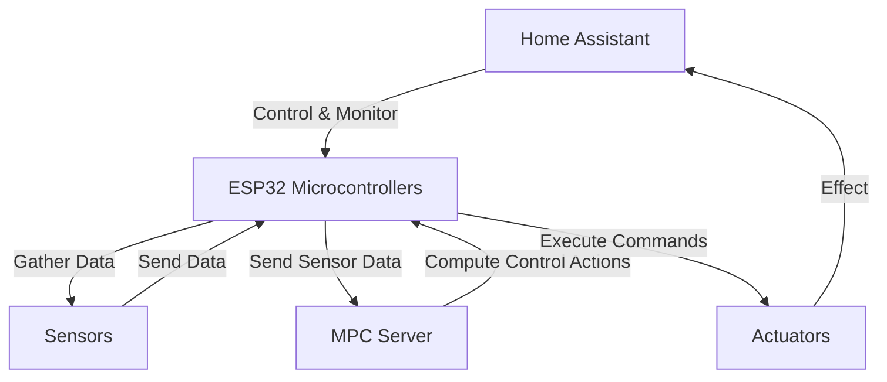
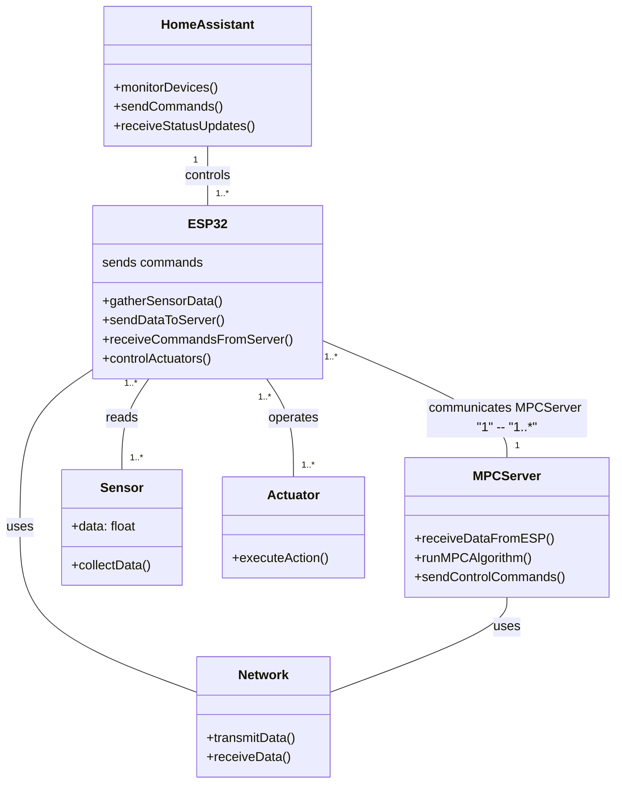

^ the above architecture doesn't account for a dynamic setpoint. 


---

# Control Architecture

```tikz 
\begin{document} 
\begin{tikzpicture}[domain=0:4] 
\draw[very thin,color=gray] (-0.1,-1.1) grid (3.9,3.9); 
\draw[->] (-0.2,0) -- (4.2,0) node[right] {$x$}; 
\draw[->] (0,-1.2) -- (0,4.2) node[above] {$f(x)$}; 
\draw[color=red] plot (\x,\x) node[right] {$f(x) =x$}; 
\draw[color=blue] plot (\x,{sin(\x r)}) node[right] {$f(x) = \sin x$}; \draw[color=orange] plot (\x,{0.05*exp(\x)}) node[right] {$f(x) = \frac{1}{20} \mathrm e^x$}; 
\end{tikzpicture} 
\end{document} 
```


```tikz
\usepackage{amsmath} 

\begin{document} 

\begin{tikzpicture}[auto, node distance=2cm] 

% Nodes 
\node [draw, rectangle] (plant) {Plant}; 
\node [draw, rectangle, above of=plant, node distance=2.5cm] (optimizer) {Optimizer}; 
\node [draw, rectangle, below of=optimizer] (plantmodel) {Plant Model}; 
\node [draw, rectangle, below of=plant, node distance=2.5cm] (stateestimator) {State Estimator}; 
\node [coordinate, left of=optimizer, node distance=2.5cm] (sumcoord) {}; 
\node [draw, circle, left of=sumcoord, node distance=1cm] (sum) {}; 
\node [coordinate, above of=sum, node distance=0.8cm] (xref) {}; 
\node [coordinate, below of=sum, node distance=1.5cm] (feedback) {}; 

% Connecting lines 

\draw [->] (sum) -- node {$\tilde{x}$} (sumcoord); 
\draw [->] (sumcoord) -- node {$\tilde{x}$} (optimizer); 
\draw [->] (optimizer) -- node {$u^*$} (plant); 
\draw [->] (plant) -- node {$y$} (stateestimator); 
\draw [->] (stateestimator) -- node {$x$} (plantmodel); 
\draw [->] (plantmodel) -- node[swap] {$x$} (sum |- plantmodel); 
\draw [->] (sum |- plantmodel) -- node[swap] {} (sum); 
\draw [->] (xref) -- node[swap] {$x^{\text{ref}}$} (sum); 

% Feedback from the plant 

\draw [->] (plant) -- ++(1cm,0) |- (feedback) -- (sum); 

\end{tikzpicture} 

\end{document}
```


```tikz

\tikzset{every picture/.style={line width=0.75pt}} %set default line width to 0.75pt        

\begin{tikzpicture}[x=0.75pt,y=0.75pt,yscale=-1,xscale=1]
%uncomment if require: \path (0,349); %set diagram left start at 0, and has height of 349

%Straight Lines [id:da43231875891590654] 
\draw [color={rgb, 255:red, 208; green, 2; blue, 27 }  ,draw opacity=1 ] [dash pattern={on 4.5pt off 4.5pt}]  (120.33,84) -- (354.83,84) ;
%Shape: Rectangle [id:dp319666920607797] 
\draw  [color={rgb, 255:red, 223; green, 223; blue, 223 }  ,draw opacity=1 ][fill={rgb, 255:red, 223; green, 223; blue, 223 }  ,fill opacity=1 ] (0,10) -- (120,10) -- (120,310) -- (0,310) -- cycle ;
%Shape: Axis 2D [id:dp8750863888202858] 
\draw [color={rgb, 255:red, 155; green, 155; blue, 155 }  ,draw opacity=1 ][line width=0.75]  (0,259) -- (610,259)(120.33,20) -- (120.33,290) (603,254) -- (610,259) -- (603,264) (115.33,27) -- (120.33,20) -- (125.33,27) (140.33,254) -- (140.33,264)(160.33,254) -- (160.33,264)(180.33,254) -- (180.33,264)(200.33,254) -- (200.33,264)(220.33,254) -- (220.33,264)(240.33,254) -- (240.33,264)(260.33,254) -- (260.33,264)(280.33,254) -- (280.33,264)(300.33,254) -- (300.33,264)(320.33,254) -- (320.33,264)(340.33,254) -- (340.33,264)(360.33,254) -- (360.33,264)(380.33,254) -- (380.33,264)(400.33,254) -- (400.33,264)(420.33,254) -- (420.33,264)(440.33,254) -- (440.33,264)(460.33,254) -- (460.33,264)(480.33,254) -- (480.33,264)(500.33,254) -- (500.33,264)(520.33,254) -- (520.33,264)(540.33,254) -- (540.33,264)(560.33,254) -- (560.33,264)(580.33,254) -- (580.33,264)(100.33,254) -- (100.33,264)(80.33,254) -- (80.33,264)(60.33,254) -- (60.33,264)(40.33,254) -- (40.33,264)(20.33,254) -- (20.33,264)(115.33,239) -- (125.33,239)(115.33,219) -- (125.33,219)(115.33,199) -- (125.33,199)(115.33,179) -- (125.33,179)(115.33,159) -- (125.33,159)(115.33,139) -- (125.33,139)(115.33,119) -- (125.33,119)(115.33,99) -- (125.33,99)(115.33,79) -- (125.33,79)(115.33,59) -- (125.33,59)(115.33,39) -- (125.33,39)(115.33,279) -- (125.33,279) ;
\draw [color={rgb, 255:red, 74; green, 74; blue, 74 }  ,opacity=1 ]  ;
%Straight Lines [id:da12584573846252511] 
\draw [color={rgb, 255:red, 74; green, 74; blue, 74 }  ,draw opacity=1 ][line width=1.5]    (120.33,59) -- (120.33,161) ;
%Straight Lines [id:da7551044568040332] 
\draw [color={rgb, 255:red, 74; green, 74; blue, 74 }  ,draw opacity=1 ][line width=1.5]    (120.33,59) -- (610.33,59) ;
%Straight Lines [id:da6942844874543851] 
\draw [color={rgb, 255:red, 208; green, 2; blue, 27 }  ,draw opacity=1 ] [dash pattern={on 4.5pt off 4.5pt}]  (120.33,40) -- (330.83,40) ;
%Straight Lines [id:da051266162746494315] 
\draw [color={rgb, 255:red, 65; green, 117; blue, 5 }  ,draw opacity=1 ]   (120.33,218.79) -- (141.08,218.71) -- (141.08,189.46) -- (159.83,189.46) -- (159.83,168.46) -- (180.83,168.46) -- (180.83,203.46) -- (200.83,203.46) -- (200.83,218.71) -- (594.83,218.71) ;
\draw [shift={(594.83,218.71)}, rotate = 0] [color={rgb, 255:red, 65; green, 117; blue, 5 }  ,draw opacity=1 ][fill={rgb, 255:red, 65; green, 117; blue, 5 }  ,fill opacity=1 ][line width=0.75]      (0, 0) circle [x radius= 1.34, y radius= 1.34]   ;
\draw [shift={(120.33,218.79)}, rotate = 359.78] [color={rgb, 255:red, 65; green, 117; blue, 5 }  ,draw opacity=1 ][fill={rgb, 255:red, 65; green, 117; blue, 5 }  ,fill opacity=1 ][line width=0.75]      (0, 0) circle [x radius= 1.34, y radius= 1.34]   ;
%Straight Lines [id:da48661046345443937] 
\draw [color={rgb, 255:red, 208; green, 2; blue, 27 }  ,draw opacity=1 ] [dash pattern={on 4.5pt off 4.5pt}]  (120.33,168.46) -- (610.33,169.08) ;
%Straight Lines [id:da5957415780841664] 
\draw [color={rgb, 255:red, 208; green, 2; blue, 27 }  ,draw opacity=1 ]   (326.83,87.17) -- (349,95) ;
%Straight Lines [id:da5568742044783566] 
\draw [color={rgb, 255:red, 208; green, 2; blue, 27 }  ,draw opacity=1 ]   (301.83,163.17) -- (324.83,149.17) ;
%Straight Lines [id:da12299314631265124] 
\draw [color={rgb, 255:red, 65; green, 117; blue, 5 }  ,draw opacity=1 ]   (366.83,213.17) -- (391.83,202.17) ;

% Text Node
\draw (60,29.5) node  [font=\small,color={rgb, 255:red, 74; green, 74; blue, 74 }  ,opacity=1 ] [align=left] {\begin{minipage}[lt]{50.059356pt}\setlength\topsep{0pt}
\begin{center}
{\footnotesize Vergangenheit}
\end{center}

\end{minipage}};
% Text Node
\draw (200,29.5) node  [font=\small,color={rgb, 255:red, 74; green, 74; blue, 74 }  ,opacity=1 ] [align=left] {\begin{minipage}[lt]{27.200000000000003pt}\setlength\topsep{0pt}
\begin{center}
{\footnotesize Zukunft}
\end{center}

\end{minipage}};
% Text Node
\draw (60,116.17) node  [font=\small,color={rgb, 255:red, 74; green, 74; blue, 74 }  ,opacity=1 ] [align=left] {\begin{minipage}[lt]{50.864000000000004pt}\setlength\topsep{0pt}
\begin{center}
{\footnotesize Sollwertverlauf}\\{\footnotesize \textit{{\fontfamily{pcr}\selectfont \textbf{w} (·|k)}}}
\end{center}

\end{minipage}};
% Text Node
\draw (376.21,105.17) node  [font=\scriptsize,color={rgb, 255:red, 208; green, 2; blue, 27 }  ,opacity=0.6 ] [align=left] {\begin{minipage}[lt]{82.97156pt}\setlength\topsep{0pt}
\begin{center}
Sollbereich\\$ $$\displaystyle y_{min} \ \leq \ y( \cdotp |k) \ \leq \ y_{max}$
\end{center}

\end{minipage}};
% Text Node
\draw (512.21,104.17) node  [font=\scriptsize,color={rgb, 255:red, 245; green, 196; blue, 35 }  ,opacity=1 ] [align=left] {\begin{minipage}[lt]{63.01335600000001pt}\setlength\topsep{0pt}
\begin{center}
Referenztrajektorie\\$ $$\displaystyle r\ ( \cdotp |k)$
\end{center}

\end{minipage}};
% Text Node
\draw (462.21,31.17) node  [font=\scriptsize,color={rgb, 255:red, 74; green, 144; blue, 226 }  ,opacity=1 ] [align=left] {\begin{minipage}[lt]{102.29444000000001pt}\setlength\topsep{0pt}
\begin{center}
optimaler Verlauf der Prädiktion\\{\footnotesize $ $$\displaystyle \hat{y} \ ( \cdotp |k)$}
\end{center}

\end{minipage}};
% Text Node
\draw (383.21,149.17) node  [font=\scriptsize,color={rgb, 255:red, 208; green, 2; blue, 27 }  ,opacity=0.6 ] [align=left] {\begin{minipage}[lt]{82.05356pt}\setlength\topsep{0pt}
\begin{center}
Stellgrößenbeschreibung\\$ $$\displaystyle u_{max}$
\end{center}

\end{minipage}};
% Text Node
\draw (7,200.4) node [anchor=north west][inner sep=0.75pt]  [font=\scriptsize,color={rgb, 255:red, 74; green, 74; blue, 74 }  ,opacity=1 ]  {$\Delta u( k+1|k) \ \leq \Delta u_{max}$};
% Text Node
\draw (428.21,201.71) node  [font=\scriptsize,color={rgb, 255:red, 245; green, 196; blue, 35 }  ,opacity=1 ] [align=left] {\begin{minipage}[lt]{83.64pt}\setlength\topsep{0pt}
\begin{center}
\textcolor[rgb]{0.25,0.46,0.02}{optimale Stellgrößenfolge}\\\textcolor[rgb]{0.25,0.46,0.02}{$ $$\displaystyle u\ ( \cdotp |k)$}
\end{center}

\end{minipage}};


\end{tikzpicture}

```


---


---
Initial test model 

$$
\begin{bmatrix}

  0.00000000 & 0.00000000 & 0.00000000 & 0.00000000 & 0.00000000 & 0.00000000 & -8.18629409 & 0.00000000 & 8.26510516 & 0.00000000 & 8.15731756 & 0.00000000 & 0.00000000 & -8.23596636 & 0.00000000 & 0.00000000 & -6.19192471 & -0.02996217 & 6.22485407 & 0.30082937 & 12.4594290 & -0.30137544 & 0.06071443 & -12.5283080 & 0.00000000 & -182.073583 & 0.00000000 & 547.836621 & -6.26484847 & -0.30500247 & -549.447864 & -0.03075632 & 6.30081425 & 0.30550706 & 183.684848 & 0.00000000 & -0.02207692 & -0.04895233 & 0.00000000 & 0.00000000 & 0.02344149 & 0.04904026 & 0.00000000 & 0.00000000 & 0.00000000 & 0.00000000 & 0.00000000 & 0.00000000 & 0.00000000 & 0.00000000 & 0.00000000 & 0.00000000 & 0.00000000 & 0.00000000 & 0.00000000 & 0.00000000 & 0.00000000 & 0.00000000 & 0.00000000 & 0.00000000 & 0.00000000 & 0.00000000 & 0.00000000 & 0.00000000 & 0.00000000 & 0.00000000 & 0.00000000 & 0.00000000 & 0.00000000 & 0.00000000 & 0.00000000 & 0.00000000 & 0.00000000 & 0.00000000 & 0.00000000 \\

  0.00000000 & 0.00000000 & 0.00000000 & 0.00000000 & 0.00000000 & 0.00000000 & 0.01796082 & 0.00000000 & -0.01795073 & 0.00000000 & 0.02848802 & 0.00000000 & 0.00000000 & -0.02849788 & 0.00000000 & 0.00000000 & 0.00000000 & 0.00000000 & 0.00000000 & 0.00000000 & 0.00000000 & 0.00000000 & 0.00000000 & 0.00000000 & 0.00000000 & 0.00000000 & 0.00000000 & 0.00000000 & 0.00000000 & 0.00000000 & 0.00000000 & 0.00000000 & 0.00000000 & 0.00000000 & 0.00000000 & 0.00000000 & 0.00000000 & 0.00000000 & 0.00000000 & 0.00000000 & 0.00000000 & 0.00000000 & 0.00000000 & 0.00000000 & 0.00000000 & 0.00000000 & 0.00000000 & 0.00000000 & 0.00000000 & 0.00000000 & 0.00000000 & 0.00000000 & 0.00000000 & 0.00000000 & 0.00000000 & 0.00000000 & 0.00000000 & 0.00000000 & 0.00000000 & 0.00000000 & 0.00000000 & 0.00000000 & 0.00000000 & 0.00000000 & 0.00000000 & 0.00000000 & 0.00000000 & 0.00000000 & 0.00000000 & 0.00000000 & 0.00000000 & 0.00000000 \\

  0.00000000 & 0.00000000 & 0.00000000 & 0.00000000 & -0.04193475 & 0.00000000 & 0.00000000 & 0.00000000 & 0.07555121 & 0.00000000 & -0.07186902 & 0.00000000 & 0.00000000 & 0.00000000 & 0.00000000 & 0.02331014 & 3.39585188 & -0.04587817 & -3.42850308 & 0.16819126 & -7.10807203 & 0.00000000 & 0.02255959 & 7.17066673 & -0.16882651 & -131.560327 & -0.17076530 & 393.997140 & 3.71658497 & 0.00000000 & -393.308384 & 0.00000000 & -3.74657512 & 0.17135725 & 130.871590 & 0.00000000 & -0.02403536 & -0.06498817 & 0.04357249 & 0.00000000 & 0.02720786 & 0.06440289 & -0.04405364 & 0.00000000 & 0.00000000 & 0.00000000 & 0.00000000 & 0.00000000 & 0.00000000 & 0.00000000 & 0.00000000 & 0.00000000 & 0.00000000 & 0.00000000 & 0.00000000 & 0.00000000 & 0.00000000 & 0.00000000 & 0.00000000 & 0.00000000 & 0.00000000 & 0.00000000 & 0.00000000 & 0.00000000 & 0.00000000 & 0.00000000 & 0.00000000 & 0.00000000 & 0.00000000 & 0.00000000 & 0.00000000 & 0.00000000 & 0.00000000 & 0.00000000 \\

  0.00000000 & 0.00000000 & 0.00000000 & 0.00000000 & 0.00000000 & 0.00000000 & 0.00713121 & 0.00000000 & -0.00712068 & 0.00000000 & 0.03932201 & 0.00000000 & 0.00000000 & -0.03933228 & 0.00000000 & 0.00000000 & 0.00000000 & 0.00000000 & 0.00000000 & 0.00000000 & 0.00000000 & 0.00000000 & 0.00000000 & 0.00000000 & 0.00000000 & 0.00000000 & 0.00000000 & 0.00000000 & 0.00000000 & 0.00000000 & 0.00000000 & 0.00000000 & 0.00000000 & 0.00000000 & 0.00000000 & 0.00000000 & 0.00000000 & 0.00000000 & 0.00000000 & 0.00000000 & 0.00000000 & 0.00000000 & 0.00000000 & 0.00000000 & 0.00000000 & 0.00000000 & 0.00000000 & 0.00000000 & 0.00000000 & 0.00000000 & 0.00000000 & 0.00000000 & 0.00000000 & 0.00000000 & 0.00000000 & 0.00000000 & 0.00000000 & 0.00000000 & 0.00000000 & 0.00000000 & 0.00000000 & 0.00000000 & 0.00000000 & 0.00000000 & 0.00000000 & 0.00000000 & 0.00000000 & 0.00000000 & 0.00000000 & 0.00000000 & 0.0 & 0.0 \end{bmatrix}
  $$
  